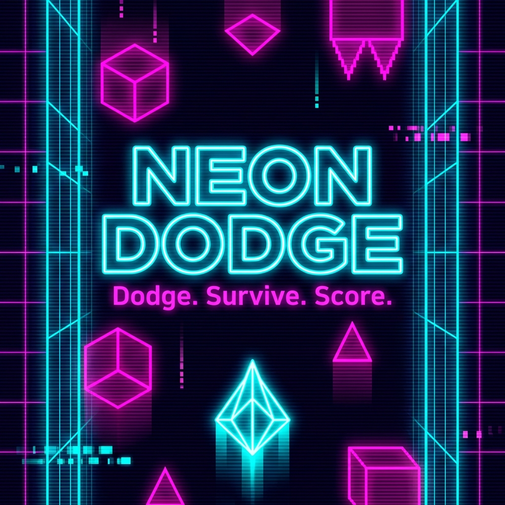

# NEON DODGE 🚀

A fast-paced, mobile-first endless arcade game built as a **Base Mini App** using Next.js.

**Dodge. Survive. Score.**



## 🎮 Game Features

- **Endless gameplay**: Dodge falling obstacles and survive as long as you can
- **Collect orbs**: Grab yellow orbs for bonus points
- **Difficulty scaling**: Speed and obstacle density increase over time
- **Touch & keyboard controls**: Drag to move on mobile, arrow keys on desktop
- **Persistent best score**: Your high score is saved locally
- **Settings**: Toggle haptics, reset best score
- **Share your score**: Post to Farcaster or copy to clipboard

## 🛠️ Tech Stack

- **Next.js 15** (App Router)
- **TypeScript**
- **Canvas API** for smooth 60fps gameplay
- **Farcaster Frame SDK** for Mini App integration

---

## 🚀 Quick Start

### Local Development

```bash
# Clone and navigate to project
cd neon-dodge

# Install dependencies
npm install

# Start development server
npm run dev
```

Open [http://localhost:3000](http://localhost:3000) in your browser.

### Build for Production

```bash
npm run build
npm run start
```

---

## 📦 Deployment to Vercel

### Step 1: Push to GitHub

```bash
# Initialize git (if not already done)
git init

# Add all files
git add .

# Commit
git commit -m "Initial commit: NEON DODGE Mini App"

# Create repo on GitHub, then add remote
git remote add origin https://github.com/YOUR_USERNAME/neon-dodge.git

# Push to main
git push -u origin main
```

### Step 2: Deploy on Vercel

1. Go to [vercel.com](https://vercel.com) and sign in
2. Click **"New Project"**
3. Import your GitHub repository
4. Vercel will auto-detect Next.js settings
5. Add environment variable:
   - **Key**: `NEXT_PUBLIC_URL`
   - **Value**: Your Vercel URL (e.g., `https://neon-dodge.vercel.app`)
6. Click **Deploy**

### Step 3: Disable Deployment Protection (Important!)

Base tooling needs to access your app without authentication:

1. Go to your project on Vercel
2. Navigate to **Settings** → **Deployment Protection**
3. Set **Vercel Authentication** to **Off** (or configure to allow public access)
4. Redeploy if needed

---

## 🔐 Signing Account Association (Base Build)

After deploying, you need to sign your app's domain to verify ownership.

### Steps:

1. **Go to Base Build Preview Tool**
   - Visit: [base.dev](https://base.dev) → Preview

2. **Enter Your Production URL**
   - Example: `https://neon-dodge.vercel.app`

3. **Navigate to Account Association Tab**
   - Click **"Generate"** or **"Sign"**
   - Connect your wallet when prompted
   - Sign the message

4. **Copy the Generated Values**
   You'll receive three values:
   ```json
   {
     "header": "eyJhb...",
     "payload": "eyJkb...",
     "signature": "MHg2..."
   }
   ```

5. **Update the Manifest**
   
   Edit `app/.well-known/farcaster.json/route.ts`:
   
   ```typescript
   accountAssociation: {
     header: "eyJhb...",      // Paste your actual header
     payload: "eyJkb...",     // Paste your actual payload
     signature: "MHg2...",    // Paste your actual signature
   },
   ```

6. **Commit and Redeploy**
   ```bash
   git add .
   git commit -m "Add account association signature"
   git push
   ```

7. **Also Remove noindex (for launch)**
   
   In the same file, change:
   ```typescript
   noindex: false,  // Change from true to false
   ```

---

## ✅ Base Build Verification Checklist

After signing and redeploying, verify everything in Base Build:

### Account Association Tab
- [ ] Shows "✓ Valid signature"
- [ ] Domain matches your deployment

### Metadata Tab
- [ ] Name: "NEON DODGE" (≤32 chars)
- [ ] Subtitle: "Endless Arcade Game" (≤30 chars)
- [ ] Description displays correctly (≤170 chars)
- [ ] Tags: game, arcade, endless, dodge, reflex
- [ ] Primary Category: games

### Assets Tab
- [ ] Icon (1024x1024) loads correctly
- [ ] Splash image (200x200) loads correctly
- [ ] Hero image (1200x630) loads correctly
- [ ] Screenshot loads correctly

### Launch Test
- [ ] Click "Launch" in Base Build Preview
- [ ] App opens in preview modal
- [ ] Game starts when tapping "START"
- [ ] Controls work (touch drag)

### Embed Test
- [ ] Create a test cast with your app URL
- [ ] Rich Mini App embed renders correctly
- [ ] "Play" button appears
- [ ] Clicking "Play" launches the app

---

## 🧪 QA Checklist

### Gameplay
- [ ] Game starts on tap/click
- [ ] Player moves smoothly with touch drag
- [ ] Player moves with arrow keys / A-D
- [ ] Obstacles fall from top at increasing speed
- [ ] Orbs appear occasionally (glowing yellow)
- [ ] Collecting orbs adds bonus points
- [ ] Collision with obstacle ends game
- [ ] Game over screen shows correct score

### Persistence
- [ ] Best score persists after page reload
- [ ] Settings (haptics) persist after reload
- [ ] Reset best score button works

### Mobile Experience
- [ ] No scroll bounce/jank
- [ ] Safe area padding works (notch devices)
- [ ] Touch controls responsive
- [ ] Share button works (opens Warpcast or copies to clipboard)

### Performance
- [ ] Smooth 60fps gameplay
- [ ] No lag during obstacle spawning
- [ ] No memory leaks on restart

### Mini App Integration
- [ ] `/.well-known/farcaster.json` returns valid JSON
- [ ] All asset URLs in manifest are accessible
- [ ] `fc:miniapp` meta tag in page source
- [ ] "Add to Mini Apps" button appears in Mini App context

---

## 📁 Project Structure

```
neon-dodge/
├── app/
│   ├── layout.tsx              # Root layout with meta tags
│   ├── page.tsx                # Main game page
│   ├── globals.css             # Global styles
│   └── .well-known/
│       └── farcaster.json/
│           └── route.ts        # Manifest API route
├── components/
│   ├── Game.tsx                # Main game canvas component
│   └── SettingsModal.tsx       # Settings modal
├── lib/
│   ├── constants.ts            # App config & colors
│   ├── gameEngine.ts           # Canvas game loop
│   └── miniapp.ts              # SDK utilities
├── public/
│   └── assets/
│       ├── icon.png            # 1024x1024
│       ├── splash.png          # 200x200
│       ├── hero.png            # 1200x630
│       ├── embed.png           # 3:2 ratio
│       └── screenshot-1.png    # Portrait
└── README.md
```

---

## 🔗 Publishing

Once verified in Base Build:

1. Share your app URL in Farcaster/Warpcast
2. The rich Mini App embed will render automatically
3. Users can tap "Play" to launch directly in client

**Example cast:**
> 🎮 Just launched NEON DODGE - an endless arcade game on Base!
> 
> Dodge neon obstacles, collect orbs, and compete for the highest score.
> 
> [Your app URL]

---

## 📄 License

MIT
